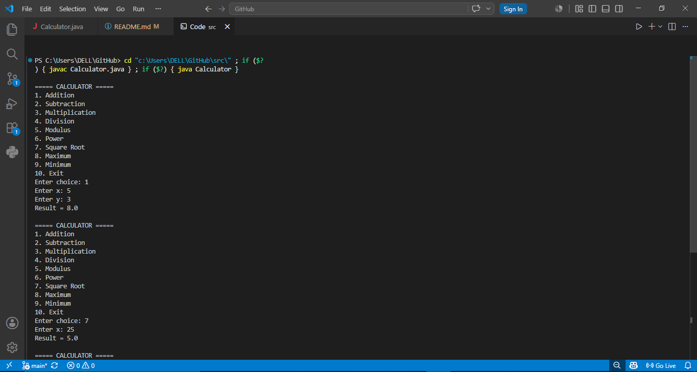

# Java Calculator App

A menu-driven calculator application built using Java.

## Features

* Addition
* Subtraction
* Multiplication
* Division
* Modulus
* Power
* Square Root
* Maximum of two numbers
* Minimum of two numbers
* Continuous calculations using a loop
* Division by zero handling
* Invalid menu choice handling

## Technologies Used

* Java
* Git
* GitHub
* VS Code

## How to Run

1. Compile the program:

```bash
javac src/Calculator.java
```

2. Run the program:

```bash
java Calculator
```

## Project Structure

```text
Java_CalculatorApp
│
├── src
│   └── Calculator.java
│
└── README.md
```

## Author

Himanshu Kumar

## Screenshot

